# Pixels-CMS

[TOC]

## 1. Introduction

Pixels-CMS is a Content Management System that focuses on image sharing. We use **Inception V3** pre-trained model for image classification and retrieval to provide automatic classification and retrieval. MySQL+Flask+Vue + ElementUI framework is used.


## 2. Design and Implementation

### 2.1 Upload images

#### 2.1.1 View

Uploading images is done in manual upload mode. Before finalizing the upload, you can click on Preview or Delete and then upload the image via the "Upload Image" button.

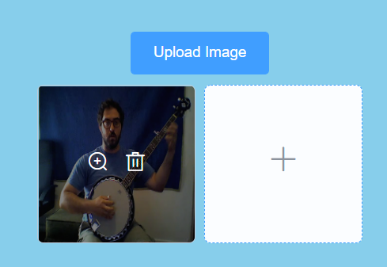

- code

```js
async handleClick() {
      if (this.fileParam === "") {
        this.$message({
          message: "Please select a picture!",
          type: "error",
        });
        return;
      }
      await reqUploadImage({ data: this.fileParam });
      this.fileList = [];
      this.fileParam = "";
    },
```

```js
// uoload image
export const reqUploadImage = ({data})=>request({
    url:"/upload",
    method: 'post',
    data: data
})
```

#### 2.1.2 Controller

**Process**

- Get the image information from the front-end request.
-  the image needs to be uploaded to AliCloud's OSS, which returns the URL of the image. 
- the image is classified using Inception V3 pre-trained model.
-  the image URL, classification tags, etc. are saved in a MySQL database


- flask code

```python
# 上传图片  将图片进行分类，将分类结果保存在数据库中
@app.route("/upload", methods=["POST"])
def upload_file():
    # 获取图像
    file = request.files.get("file")
    if file:
        # 上传到OSS
        image_data = file.read()  # 一定要预先存储数据，否则read一次后就从缓存中清楚了，导致数据失效
        url = aliOss.upload_file(image_data)
        # print(file)
        # 图片分类,需要转换为二进制数据
        # print(image_data)
        res = image_classify(image_data)
        tags = res[0][0]
        score = res[0][1] * 100
        print(tags, score)
        # 保存在数据库中
        pixelGb.insert_pic(url=url, owner_id=5, owner_name="Adam Boost", note="pic", tags=tags, score=score)
        return jsonify({'data': 'success'})
    else:
        return jsonify({'data': 'error'})
```

#### 2.1.3 Service

- Upload images to AliCloud

```python 
class AliOss:
    def __init__(self):
        # 阿里云账号AccessKey拥有所有API的访问权限，风险很高。
        self.auth = oss2.Auth('AccessId', 'AccessKey')
        self.endpoint = 'oss-cn-shanghai.aliyuncs.com'
        # 填写Bucket名称，例如examplebucket。
        self.bucket_name = 'pixels-dis'
        # 填写Bucket名称。
        self.bucket = oss2.Bucket(self.auth, self.endpoint, self.bucket_name)

    def upload_file(self, data):
        today = datetime.datetime.today()
        key = str(today.year) + '-' + str(today.month) + '-' + str(today.day) + "/" + str(uuid.uuid4()).split('-')[0] + ".png"
        self.bucket.put_object(key, data)
        return str(self.bucket.sign_url('GET', key, 60 * 60 * 24)).split('?')[0]
```

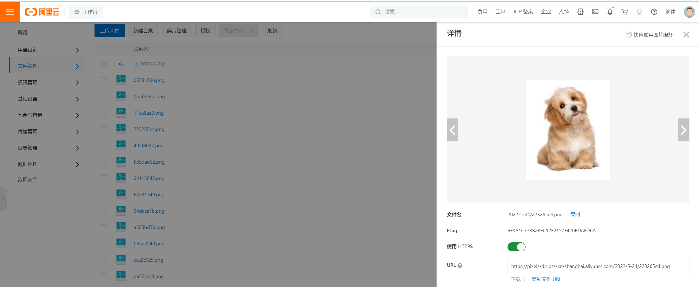

- Image Classification

```python
# 图像分类
def image_classify(image_data):
    # 创建graph
    create_graph()
    sess = tf.Session()
    # Inception-v3模型的最后一层softmax的输出
    softmax_tensor = sess.graph.get_tensor_by_name('softmax:0')

    # 输入图像数据，得到softmax概率值（一个shape=(1,1008)的向量）
    predictions = sess.run(softmax_tensor, {'DecodeJpeg/contents:0': image_data})
    # predictions = sess.run(softmax_tensor, image_data)
    # (1,1008)->(1008,)
    predictions = np.squeeze(predictions)

    # ID --> English string label.
    node_lookup = NodeLookup()

    # 取出前5个概率最大的值（top-5)
    res = []
    top_5 = predictions.argsort()[-5:][::-1]
    for node_id in top_5:
        human_string = node_lookup.id_to_string(node_id)
        score = predictions[node_id]
        res.append([human_string, score])
        # print('%s (score = %.5f)' % (human_string, score))
    sess.close()
    return res
```

- Save to database

```python
    # 插入图片信息
    def insert_pic(self, url, owner_id, owner_name, note, tags, score):
        # 类型全部都是%s
        sql = "INSERT INTO picture(`url`, `owner_id`, `owner_name`, `note`, `tags`, `score`) VALUES (%s, %s, %s, %s, %s, %s)"
        try:
            # print(sql)
            self.cur.execute(sql, (url, owner_id, owner_name, note, tags, score))
            self.connection.commit()  # 提交执行
        except:
            self.connection.rollback()  # 回滚
```

### 2.2 Search images

####  2.2.1 View

You can search for images by keywords, or by category tags. The data will be sorted by descending order according to the score of the image classification.

- Search by keyword：when searching, all current image tag data can be prompted


- Search by image tag: you can check different tags as search criteria to search for images

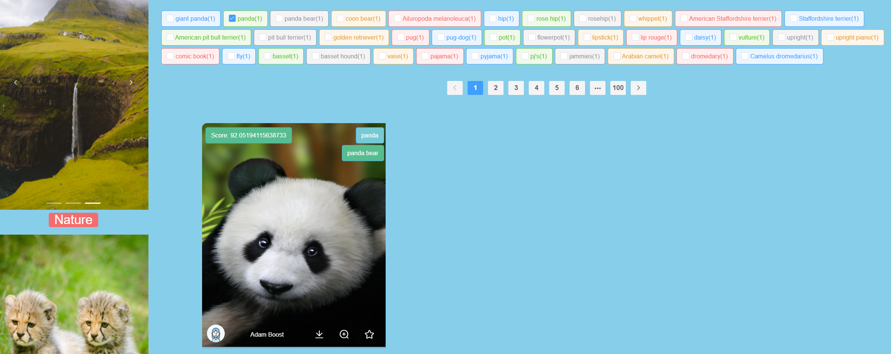


- ==Show image information==

  When you hover over the image, you can view detailed information about the image: information about the person who uploaded the image, information about the tags of the image category, and the score of the image category. Also, each image offers download, preview and collection functions.


#### 2.2.2 Controller

- Get all tag data

```python
@app.route("/tags", methods=['GET'])
def get_tags():
    res = []
    for key in tagDict.keys():
        res.append({
            'label': key,
            'size': tagDict[key],
        })
    res.sort(key=lambda x: x['size'], reverse=True)
    return jsonify(res)
```

- Search image [tag and keyword]

```python
# 根据关键词进行搜索
@app.route("/search", methods=['GET'])
def search():
    keyword = request.values.get("keyword")
    res = pixelGb.get_pic_keyword(keyword)
    return jsonify({"data": res})
```

- get all images

```python
# 查询所有的图片
@app.route("/images", methods=["GET"])
def get_all_images():
    res = pixelGb.get_all_pics()
    return jsonify({"data": res})
```

#### 2.2.3 Service

- get all tags：Statistical information about all image tags

```python

def count_tags():
    images = pixelGb.get_all_pics()
    tags = []
    for image in images:
        # print(image)
        tags.extend(image['tags'].split(", "))
    return Counter(tags)
```

- get all images from database

```python
    def get_all_pics(self):
        sql = "SELECT * FROM `picture`"
        try:
            self.cur.execute(sql)
            return self.cur.fetchall()  # 接受全部返回行
        except:
            return "Error: unable to fetch data"
```

- recommend images [Search]

```python
    # 根据关键词模糊查询，在tags中存在tag的数据，按照score进行排序
    def get_pic_keyword(self, keyword):
        sql = "SELECT * FROM `picture` WHERE LOCATE(%s, `tags`) ORDER BY score DESC"
        try:
            self.cur.execute(sql, (keyword))
            return self.cur.fetchall()
        except:
            self.connection.rollback()  # 回滚
```


### 2.3 Collect Image

#### 2.3.1 View

- Click the tag to bookmark the image or unbookmark it

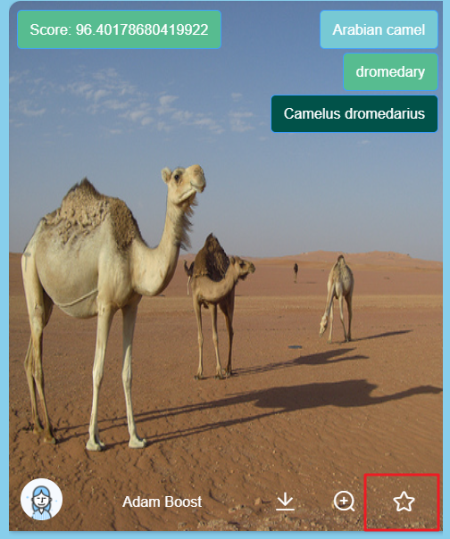

- Click on the navigation bar [Collect] for personal collection center

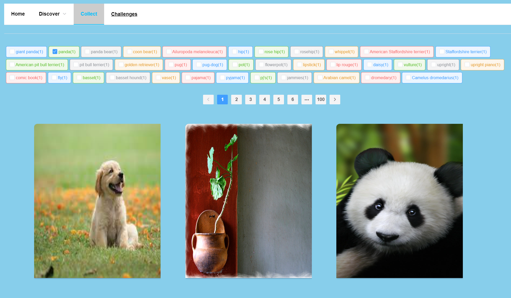


#### 2.3.2 Controller

- bookmark the image or unbookmark it

```python
# 收藏或者取消收藏图片
@app.route("/collect", methods=['GET'])
def collect_image():
    imageId = request.values.get("imageId")
    userId = request.values.get("userId")
    status = request.values.get("status")
    print(imageId, userId)
    if status == '1':  # 收藏
        pixelGb.collect_image(userId, imageId)
    elif status == '0':
        pixelGb.cancel_collect_image(userId, imageId)
    return jsonify({'data': 'success'})
```

- Search all images in the user's collection

```python
# 获取用户所有的收藏
@app.route("/user/collect", methods=['GET'])
def get_user_collect():
    userId = request.values.get('userId')
    res = pixelGb.get_user_collect(userId)
    return jsonify({"data": res})
```

#### 2.3.3 Service

- bookmark the image or unbookmark it

```python
    # 收藏图片
    def collect_image(self, userId, imageId):
        # 类型全部都是%s
        sql = "INSERT INTO collect(`user_id`, `image_id`) VALUES (%s, %s)"
        try:
            # print(sql)
            self.cur.execute(sql, (userId, imageId))
            self.connection.commit()  # 提交执行
        except:
            self.connection.rollback()  # 回滚

    # 取消收藏
    def cancel_collect_image(self, userId, imageId):
        # 类型全部都是%s
        sql = "DELETE FROM `collect` WHERE user_id=(%s) AND image_id=(%s)"
        try:
            # print(sql)
            self.cur.execute(sql, (userId, imageId))
            self.connection.commit()  # 提交执行
        except:
            self.connection.rollback()  # 回滚
```

- Search all images in the user's collection

```python
    # 获取用户收藏的图片集
    def get_user_collect(self, userId):
        sql = "SELECT p.`id`, p.`url`,p.`owner_id`,p.`owner_name`,p.`tags`,p.`score` FROM `picture` AS p LEFT JOIN `collect` ON p.id=collect.image_id WHERE user_id=(%s)"
        try:
            self.cur.execute(sql, (userId))
            return self.cur.fetchall()  # 接受全部返回行
        except:
            return "Error: unable to fetch data"
```


## 3. Image classification using Inception V3 Model

- tensorflow：2.3.1

I rewrote part of the code for image classification so that it can process the incoming image data from the front-end in real time and query the image classification specific information from the prediction results.


### 3.1 Create Graph

```python
# 读取训练好的Inception-v3模型来创建graph
def create_graph():  # 在当前的版本中，gfile已经定义在io包的file_io.py中
    with tf.gfile.Open(os.path.join(model_dir, 'classify_image_graph_def.pb'), 'rb') as f:
        graph_def = tf.GraphDef()
        graph_def.ParseFromString(f.read())
        tf.import_graph_def(graph_def, name='')
```

### 3.2 Get tag data

```python
# 将类别ID转换为人类易读的标签
class NodeLookup(object):
    def __init__(self,
                 label_lookup_path=None,
                 uid_lookup_path=None):
        if not label_lookup_path:
            label_lookup_path = os.path.join(
                model_dir, 'imagenet_2012_challenge_label_map_proto.pbtxt')
        if not uid_lookup_path:
            uid_lookup_path = os.path.join(
                model_dir, 'imagenet_synset_to_human_label_map.txt')
        self.node_lookup = self.load(label_lookup_path, uid_lookup_path)

    def load(self, label_lookup_path, uid_lookup_path):
        if not tf.gfile.Exists(uid_lookup_path):
            tf.logging.fatal('File does not exist %s', uid_lookup_path)
        if not tf.gfile.Exists(label_lookup_path):
            tf.logging.fatal('File does not exist %s', label_lookup_path)

        # Loads mapping from string UID to human-readable string
        proto_as_ascii_lines = tf.gfile.GFile(uid_lookup_path).readlines()
        uid_to_human = {}
        p = re.compile(r'[n\d]*[ \S,]*')
        for line in proto_as_ascii_lines:
            parsed_items = p.findall(line)
            uid = parsed_items[0]
            human_string = parsed_items[2]
            uid_to_human[uid] = human_string

        # Loads mapping from string UID to integer node ID.
        node_id_to_uid = {}
        proto_as_ascii = tf.gfile.GFile(label_lookup_path).readlines()
        for line in proto_as_ascii:
            if line.startswith('  target_class:'):
                target_class = int(line.split(': ')[1])
            if line.startswith('  target_class_string:'):
                target_class_string = line.split(': ')[1]
                node_id_to_uid[target_class] = target_class_string[1:-2]

        # Loads the final mapping of integer node ID to human-readable string
        node_id_to_name = {}
        for key, val in node_id_to_uid.items():
            if val not in uid_to_human:
                tf.logging.fatal('Failed to locate: %s', val)
            name = uid_to_human[val]
            node_id_to_name[key] = name

        return node_id_to_name

    def id_to_string(self, node_id):
        if node_id not in self.node_lookup:
            return ''
        return self.node_lookup[node_id]
```

### 3.3 Image Classification

```python
# 图像分类
def image_classify(image_data):
    create_graph()
    sess = tf.Session()
    # Inception-v3模型的最后一层softmax的输出
    softmax_tensor = sess.graph.get_tensor_by_name('softmax:0')
    # 输入图像数据，得到softmax概率值（一个shape=(1,1008)的向量）
    predictions = sess.run(softmax_tensor, {'DecodeJpeg/contents:0': image_data})
    # predictions = sess.run(softmax_tensor, image_data)
    # (1,1008)->(1008,)
    predictions = np.squeeze(predictions)

    # ID --> English string label.
    node_lookup = NodeLookup()

    # 取出前5个概率最大的值（top-5)
    res = []
    top_5 = predictions.argsort()[-5:][::-1]
    for node_id in top_5:
        human_string = node_lookup.id_to_string(node_id)
        score = predictions[node_id]
        res.append([human_string, score])
        # print('%s (score = %.5f)' % (human_string, score))
    sess.close()
    return res
```

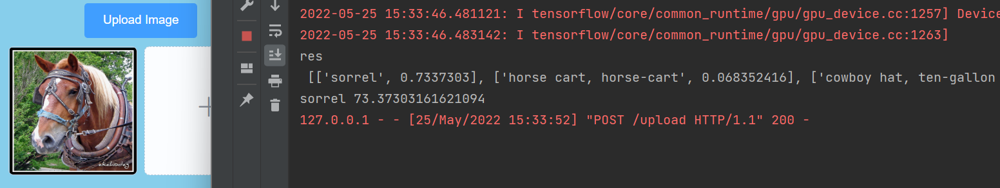


## 4. System Demonstration

### 4.1 Upload image

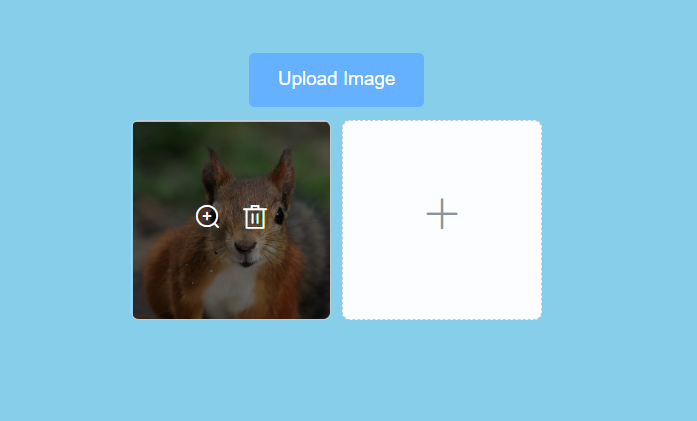

### 4.2 Get image classification information

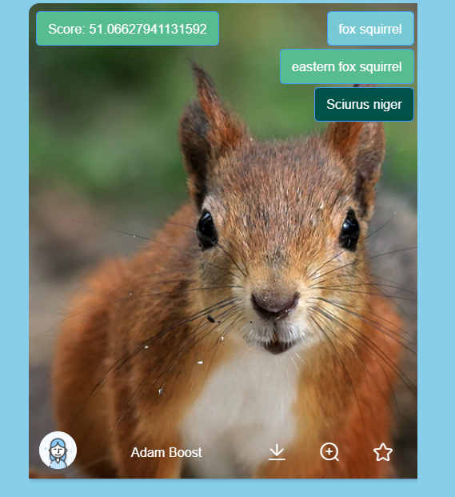

### 4.3 Collect image

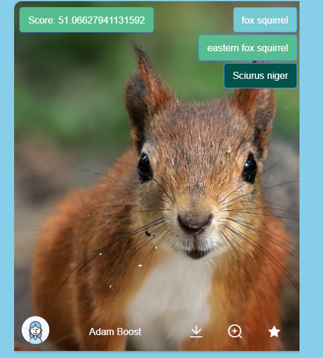

- personal collecrions

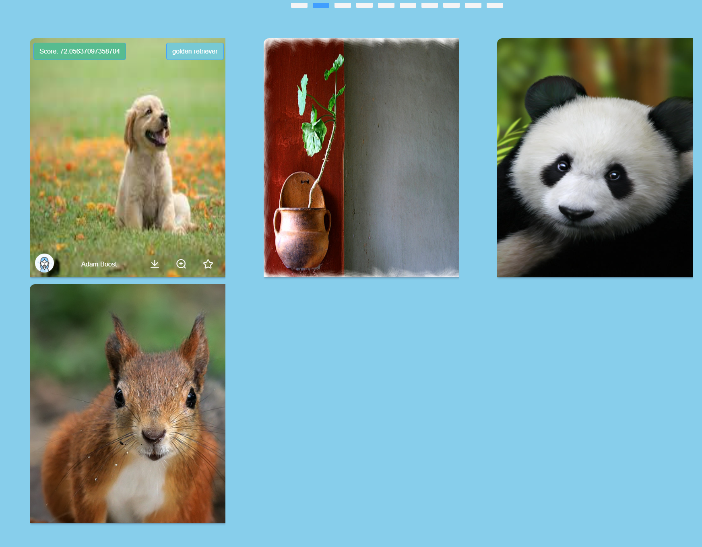


### 4.4 Search Image

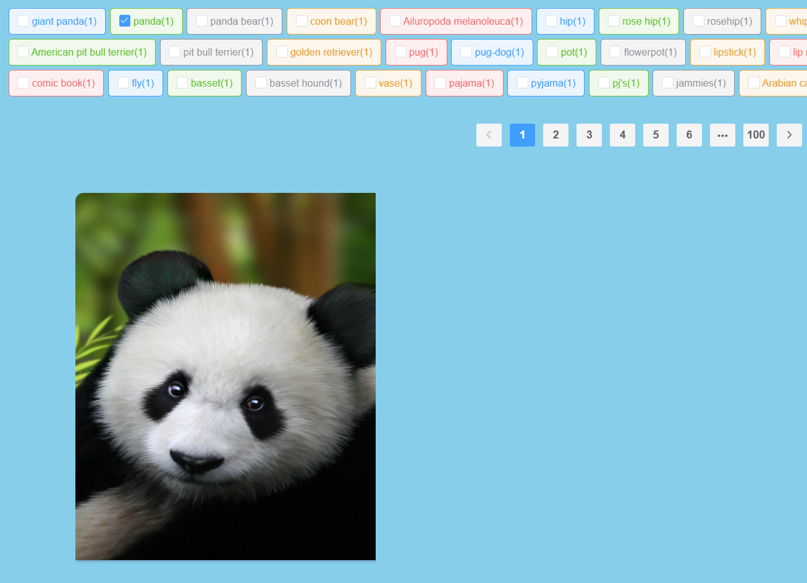


### 4.5 Download image

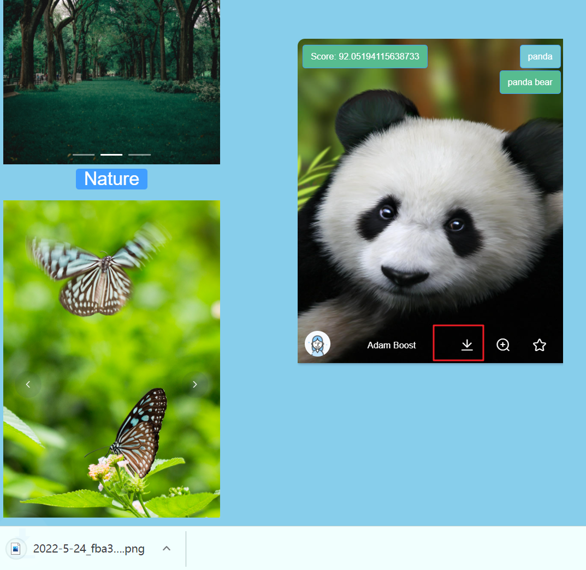

### 4.6 Preview images

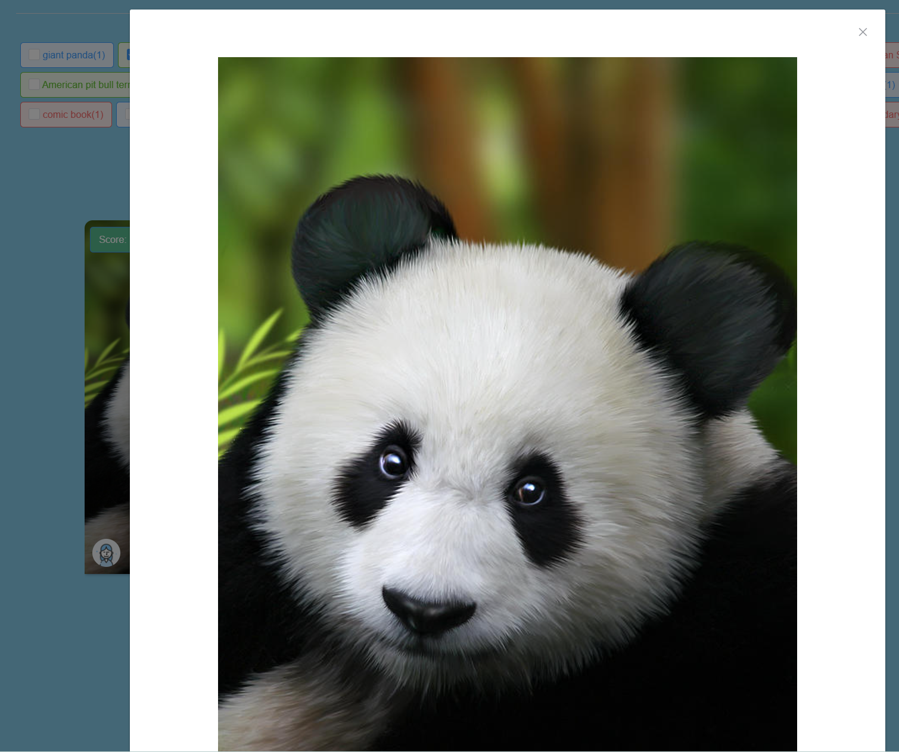


### 4.7 Rotational image


## 5. Future Work

- Improve image classification accuracy. Inception V3's image classification label information is specific to the category of the thing itself, such as pit bulls, rather than being directly classified as dogs. This leads to unreliable querying by tag.
- Improve the front-end interface, than the picture rotation map, user registration and login, etc.
- Improve the speed of search. Currently, MySQL is used to store image classification data, which is too inefficient for retrieving information from tags, which requires fuzzy queries in the database. ElasticSearch can be used to store image classification information to improve the efficiency of retrieval and clustering analysis.

## 6. How to run

- clone

```shell
git clone git@github.com:lif314/pixels-ImageCMS.git
```

- create database `piexls_cms`, run the sql script in the `sql` directory to import the data. The configuration information is in the `MysqlDb.py` file

- Install python dependencies

```shell
pip install -r requirements.txt
```

- Run falsk project

```shell
python run app.py
```

- Running the Vue project.

```shell
cd pixels-ui

npm install

npm run serve
```
